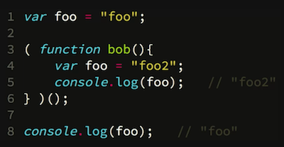

Parts of this section:

* Nested Scope
* Hoisting
* Closure
* Modules

**Definition of scope:** Where to look for variables. The set of rules that helps us figure out where stuff is found.

A lot of people think JavaScript is a dynamic interpreted language, but it is actually a compiled language. The JS engine compiles the code before it runs (“It’s a two pass system”). For example… say you have a syntax error on line 10 of your code. It doesn’t run lines 1-9 before erroring out. It errors immediately… while the JS engine is compiling/parsing it.

=\> It’s important to think about it as a "2 pass system". During the first pass, lexical scope gets set up. (aka “scope is a compile-time process”)

**Lexical Scope:** Scope that is based on _where_ variables & blocks are authored in the code.

JavaScript has function scope (with a couple of notable exceptions)

* The individual unit of scope is the function.

```js
var foo = 'bar'

function bar() {
  var foo = 'baz'
}

function baz(foo) {
  foo = 'bam'
  bam = 'yay'
}
```

## Compile Time...

**Line 1:**

Compiler: “Hey global scope manager, I found a formal declaration for “foo”. Have you ever heard of him?"

Global Scope Manager: “Nope, never heard of him. I’ll get him registered!”

**Line 3:**

Compiler: “Hey global scope manager, I found a declaration for “bar”. Ever heard of him?”

Global Scope Manager: “Nope. I’ll register him!”

**Line 4:**

Compiler: “Hey scope of ‘Bar’, I found a declaration for ‘foo’. Ever heard of him?”

‘Bar’ Scope Manager: “Nope. I’ll register him!”

**Line 7:**

Compiler: “Hey global scope manager, I found a declaration for “baz”. Ever heard of him?”

Global Scope Manager: “Nope. I’ll register him!”

**Line 7:**

Compiler: “Hey scope of ‘Baz’, I have a declaration for foo (the function param). Ever heard of him?”

‘Baz’ Scope Manager: “Nope. I’ll register him!”

```js
var foo = 'bar'

function bar() {
  console.log(foo)
  var foo = 'baz'
}

bar() // undefined
```

(this is undefined… since JS is a two pass system, the variable foo exists within the scope of bar… but hasn’t been declared yet. This is why it is undefined, instead of printing “bar” from the outer scope.)

**Shadowing** - using the same variable name in different levels of scope. There is no way to access the value from outer scope if you use shadowing.

### Aside: LHS vs RHS

If a variable is on the left hand side of the equal sign, its the TARGET of the assignment. If it’s on the right hand side of the equals, it's the source of the assignment.

LHS =\> Target

RHS =\> Source

Some items are difficult to tell… but the trick is to ask if it’s a target of an assignment. If it’s a target of an assignment, it’s an LHS. If it’s not a target, it’s a RHS.

## Runtime (Execution)…

All declarations (variables & functions) are done. That happened at compile time.

**Line 1:**

JS Engine: “Hey global scope, I’ve got an LHS reference to a variable called ‘foo'. Ever heard of him?”

Global Scope Manager: “Yes! Here it is!” (Hands him the bucket).

JS Engine assigns “bar” to that bucket.

(pretend bar() gets executed)

**Line 4:**

JS Engine: “Hey scope of bar… I have a LHS refernce to foo. Ever heard of him?”

Bar Scope Manager: “Yes! Here it is!” (Hands him the bucket)

JS Engine assigns “baz” to that bucket.

(pretend baz() gets executed w/o an argument):

**Line 8:**

JS Engine: “Hey scope of baz, I have an LHS reference to foo. Ever heard of him?”

Baz scope manager: “Yes! here it is” (Hands him the bucket, formed on Line 7)

JS Engine assigns “bam” to that bucket.

**Line 9:**

JS Engine: “Hey scope of bar, I have an LHS reference to bam. Ever heard of him?”

Baz scope manager: “Nope, nothing here! Try up one level of scope.”

JS Engine: “Hey global scope, I have an LHS reference to bam. Ever heard of him?”

Global scope manager: “No… so I made one for you! Here you go!”

JS Engine assigns “yay” to global variable called "bam”.

=\> THIS IS BAD (implicitly creating variables on the global scope by assigning to variables never formally declared). This is a poor practice, should never be done on purpose.

=\> using strict mode (“use strict”) causes this to cause an error.

## Strict Mode

(Note: it is needed for a lot of ES6 features… so it is implemented by transpilers (like Babel) automatically… which is why I don’t manually have to write it in my files.)

Strict mode causes potential pitfalls to error (that used to not error)

Those items also harm performance

## Unfulfilled LHS vs RHS

An unfulfilled LHS (a target of an assignment that was never formally declared), in non-strict mode, results in an implicit global variable.

An unfulfilled RHS that has never been formally declared results in a reference error.

Undefined: has been declared, but has no value currently

Undeclared: has never been formally declared in an available scope

## Named function expressions

```js
var foo = function bar() {
  var foo = 'baz'

  function baz(foo) {
    foo = bar
    foo // function...
  }
  baz()
}

foo()
bar() // Error!
```

Here, the function bar is assigned to the variable foo. Externally (in its wrapping scope), you can only reference it by calling ‘foo()’… calling ‘bar()’ results in an error.

However, you can reference bar from within itself.

Another example:

An "anonymous function expression":

```js
var clickHandler = function() {
  // ..
}
```

A "named function expression":

```js
var keyHandler = function keyHandler() {
  // ..
}
```

A "function declaration":

```js
function keyHandler() {
  // ..
}
```

Kyle recommends almost always using function declarations rather than function expressions. If you are going to use a function expression, always use a named function expression:

1. It provides a safe way for the function to refer to itself from within itself (for example, for recursion)

2. More debuggable stack traces

3. Better self-documentation of your code

## Lexical Scope

* Scope that is based on _where_ variables & blocks are authored in the code.

(an alternate scoping model is "dynamic scope".. this would be scope that doesn't depend on where the scope was authored... but where it was called at runtime.)

```js
// theoretical dynamic scoping
// aka, not how JS actually works :)
function foo() {
  console.log(bar) // dynamic!
}

function baz() {
  var bar = 'bar'
  foo() // "bar"
}

baz()
```

## Function Scoping

```js
var foo = 'foo'
// ..

// pretend these lines added later
var foo = 'foo2'
console.log(foo) // "foo2"
// ..

console.log(foo) // "foo2" -- oops!
```

To fix this, we need to add a scope (a function):

```js
var foo = 'foo'

function bob() {
  var foo = 'foo2'
  console.log(foo) // "foo2"
}
bob()

console.log(foo) // "foo" -- good
```

However, a problem with this pattern is that it pollutes the surrounding scope with an unnecessary function name.

## IIFE (Immediately Invoked Function Expression) Pattern



## Block Scope

With ES6, we have access to block-level scope via the `let` and `const` keywords.

```js
function diff(x, y) {
  if (x > y) {
    let tmp = x
    x = y
    y = tmp
  }

  return y - x
}
```

With the presence of `let`/`const`, the `if` statement now has it's own block of scope (it's own lexical environment)

### `let` & `var`

Kyle recommends not switching wholesale from `var` to `let`. Use `let` if the variable should be block-scoped, use `var` if the variable should be function-scoped.

On the other hand, if you have a variable that is used all throughout a function, the `var` keyword better communicates that:

```js
function repeat(fn, n) {
  var result

  for (let i = 0; i < n; i++) {
    result = fn(result, i)
  }

  return result
}
```

Here, `result` is used throughout the function, which is better communicated by declaring with `var`. the `i` iterator in the `for` loop should not be accessible anywhere else, so it's a better use case for `let`.

Really, this distinction is all about code readability and communication of intent to other developers.

### `const`

A constant is a variable that cannot be redefined (_not_ a value that doesn't change).

```js
var a = 2
a++ // 3

const b = 2
b++ // Error!

const c = [2]
c[0]++ // 3 <--- oops!?
```

Kyle recommends agaist the heavy use of `const`, due to the amount of misunderstanding around what a constant actually is. It's setting a trap for people who don't truely understand how it works.

Also, if you keep your blocks short, it's also not that benefitial.

## Challenge 2: Scoping

**Q: What type of scoping rule(s) does JavaScript have?**
lexical

**Q: What are 3 different ways you can create a new scoped variable?**

1. var (also function, etc) 2. let/const 3. catch clause

**Q: What's the difference between undeclared and undefined?**
Undefined has been declared in the scope, but currently has no value.
Undeclared has never been formally declared in an available scope.

## Hoisting

```js
a // ???
b // ???
var a = b
var b = 2
b // 2
a // ???
```

What is going to happen at line 1?

* if you think about it as a two-pass system:
  * `a` exists (the compiler found `var a` at compile time and created the variable) but it has not yet been assigned a value. So a is undefined.
* if you think about it as hoisting:
  * the variable declarations (only declarations, not assignments) are 'hoisted' to the top
  ```js
  var a
  var b
  a
  b
  a = b
  b = 2
  b
  a
  ```

Another example:

```js
var a = b()
var c = d()
a
c

function b() {
  return c
}

var d = function() {
  return b()
}
```

When thought of as "hoisted", this looks like:

```js
function b() {
  return c
}
var a
var c
var d
a = b()
c = d() // Type error. d is undefined... can't execute undefined.
a
c
d = function() {
  return b()
}
```

Also, `let` variables don't hoist the same way (technically, they do hoist, but they don't initialize like a `var` does):

```js
function foo(bar) {
  if (bar) {
    console.log(baz) // ReferenceError
    let baz = bar
  }
}

foo('bar')
```
