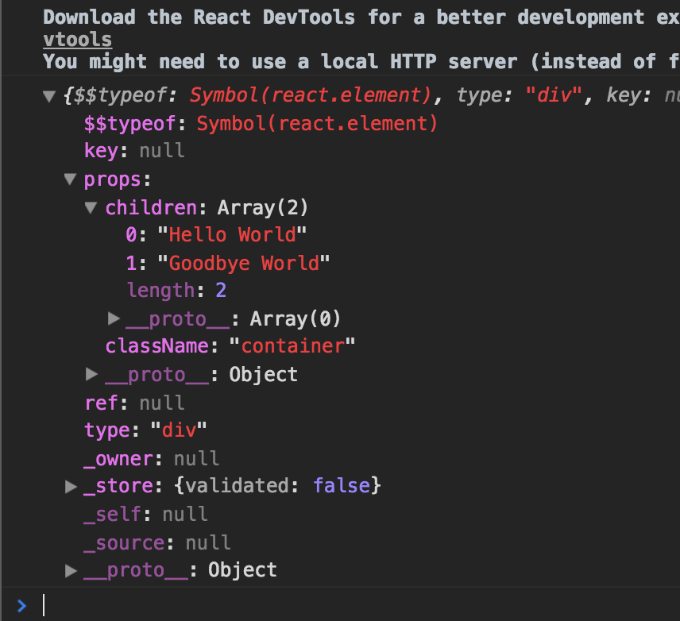

# The Beginner's Guide to ReactJS (via Egghead.io)

https://egghead.io/courses/the-beginner-s-guide-to-reactjs

## Video 2: Write Hello World with raw React APIs

We start off by creating/appending a element to the DOM with vanilla JavaScript:

```html
<div id="root"></div>

<script type="text/javascript">
  const rootElement = document.getElementById('root')
  const element = document.createElement('div')
  element.textContent = 'Hello World'
  element.className = 'container'
  rootElement.appendChild(element)
</script>
```

We create a div that contains the text "Hello World", and append it as a child to the root div.

Now, lets import the React and ReactDOM libraries, and create this same element using React:

```html
<div id="root"></div>

<script crossorigin src="https://unpkg.com/react@16/umd/react.development.js"></script>
<script crossorigin src="https://unpkg.com/react-dom@16/umd/react-dom.development.js"></script>

<script type="text/javascript">
  const rootElement = document.getElementById('root')

  const element = React.createElement(
    'div',
    { className: 'container' },
    'Hello World',
    'Goodbye World'
  )
  ReactDOM.render(element, rootElement)
</script>
```

This creates a div, assigns the props (including the className, and any children.)

If we console.log `element`, this is what we'd see:



For convenience, there are a couple ways you can pass in children:

```html
  <script type="text/javascript">
    // Method 1
    const element = React.createElement(
      'div',
      { className: 'container' },
      'Hello World',
      'Goodbye World'
    )

    // Method 2
    const element = React.createElement(
      'div',
      {
        className: 'container',
        children: ['Hello World', 'Goodbye World']
      },
    )
  </script>
```

## Video 3: Use JSX with React

You could write your entire app using React.createElement... but that would be a pain. Enter JSX. Here's the same div as our last example, but using JSX. (Note: this also includes Babel to transpile JSX into valid JavaScript)

```html
<div id="root"></div>

<script crossorigin src="https://unpkg.com/react@16/umd/react.development.js"></script>
<script crossorigin src="https://unpkg.com/react-dom@16/umd/react-dom.development.js"></script>
<script src="https://unpkg.com/babel-standalone@6/babel.min.js"></script>

<script type="text/babel">
  const rootElement = document.getElementById('root')
  const element = <div className="container">Hello World</div>
  ReactDOM.render(element, rootElement)
</script>
```

In JSX, curly braces are how we exit JSX-land and enter JavaScript-land:

```js
const content = 'Hello World'
const myClassName = 'container'
const element = <div className={myClassName}>{content}</div>
```

And this works too! (sort of a marriage between JSX and our .createElement syntax):

```js
const props = {
  className: 'container',
  children: ['Hello World', 'Goodbye World']
}

<div {...props} />
```

Note: using this object-spread-like syntax gives precedence to whatever shows up last. For example:

```js
const props = {
  className: 'container'
}

<div className="my-class" {...props} /> // class would be 'containter'
<div {...props} className="my-class" /> // class would be 'my-class'
```

## Video 4: Create Custom React Components

To create custom, reusable components we use functions (need to start with a capitol letter) that receives props:

```js
const rootElement = document.getElementById('root')

const Message = props => <div>{props.children}</div>

const element = (
  <div className="container">
    <Message>Hello World</Message>
    <Message>Goodbye World</Message>
  </div>
)

ReactDOM.render(element, rootElement)
```

## Video 5: Validate Custom React Component Props with PropTypes

PropTypes help validate (and document) your components. Here is an example using the offical PropTypes library:

```js
class SayHello extends React.Component {
  render() {
    const { firstName, lastName } = this.props
    return (
      <div>
        Hello {firstName} {lastName}
      </div>
    )
  }
}

SayHello.propTypes = {
  firstName: PropTypes.string.isRequired,
  lastName: PropTypes.string.isRequired
}
```

Or, since we're using a class, we can declare props using a static class property:

```js
class SayHello extends React.Component {
  static propTypes = {
    firstName: PropTypes.string.isRequired,
    lastName: PropTypes.string.isRequired
  }

  render() {
    const { firstName, lastName } = this.props
    return (
      <div>
        Hello {firstName} {lastName}
      </div>
    )
  }
}
```

The production version of React does not use PropTypes. They are just a dev tool.

## Video 6: Conditionally Render a React Component

When you use curly braces within JSX, the JavaScript code they contain must evaluate to an expression. This is why ternaries are a popular way to conditionally render output:

```js
class SayHello extends React.Component {
  static propTypes = {
    firstName: PropTypes.string
  }

  render() {
    const { firstName } = this.props
    return <div>Hello {firstName ? firstName : 'Unknown'}!</div>
  }
}
```

## Video 7: Rerender a React Application

React is smart in its rerendering. Consider this code:

```html
<div id="root"></div>

<script crossorigin src="https://unpkg.com/react@16/umd/react.development.js"></script>
<script crossorigin src="https://unpkg.com/react-dom@16/umd/react-dom.development.js"></script>
<script src="https://unpkg.com/babel-standalone@6/babel.min.js"></script>

<script type="text/babel">
  const rootElement = document.getElementById('root')

  function tick() {
    const time = new Date().toLocaleTimeString()
    const element = (
      <div>
        It is
        <input value={time} />
        <input value={time} />
        <input value={time} />
      </div>
    )

    ReactDOM.render(element, rootElement)
  }

  tick()
  setInterval(tick, 1000)
</script>
```

The powerful thing about this is that it only rerenders the part of the DOM that needs to update, not the entire DOM. (For instance, if you click inside one of those inputs, you'll keep focus between re-renders). Run this same code with out React, and the entire DOM re-renders (you lose focus).

## Video 8: Style React Components

* uses objects rather than strings for declaring styles, which gives much more flexibility when composing styles:

`style={{ paddingLeft: 20 }}` or `style={{ paddingLeft: '20px' }}`

* uses `className` rather than `class` (too many namespace conflicts with the keyword `class`)

**Note: From this point on, I'm just noting things that are new to me, rather than trying to take notes on everything, just so I can move a little faster.**

## Video 10: Use Component State with React

New to me was the idea of a setState updater function. "If you need to reference some existing state as you update state, you can use an updater function that returns the new state":

```js
this.setState(state => {
  if (state.running) {
    clearInterval(this.timer)
  } else {
    this.timer = setInterval(() => {
      this.setState({ lapse: Date.now() - startTime })
    })
  }
  return { running: !state.running }
})
```

## Video 12: Use Class Components with React

Using 'public class fields' rather than inline arrow functions:

Inline arrow function:

```js
class MyComponent extends React.Component {
  state = { count: 0 }

  render() {
    const { count } = this.state
    return (
      <button onClick={() => this.setState({ count: ++count })}>{count}</button>
    )
  }
}
```

Public class field for the increment function:

```js
class MyComponent extends React.Component {
  state = { count: 0 }

  incrementClicks = () => {
    const { count } = this.state
    this.setState({ count: ++count })
  }

  render() {
    const { count } = this.state
    return <button onClick={this.incrementClicks}>{count}</button>
  }
}
```

This cleans up the render function, and removes a possible performance bottleneck.
