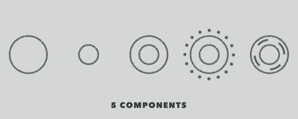
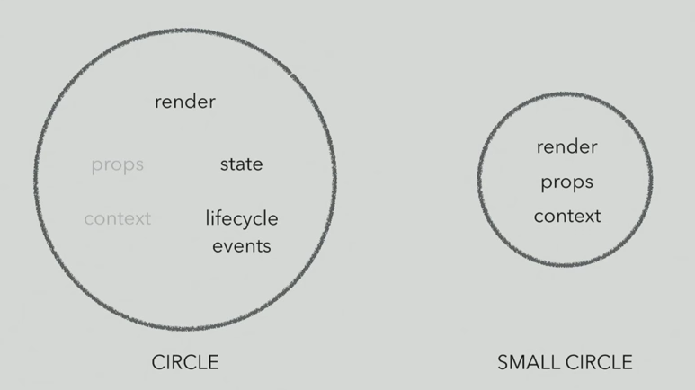
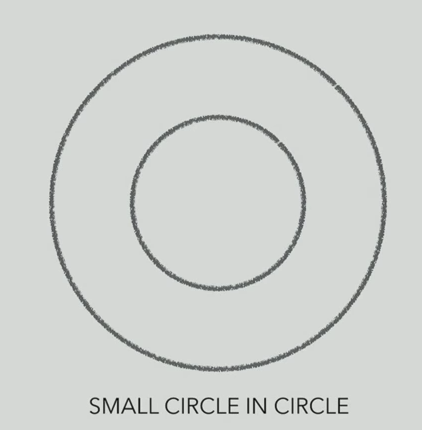
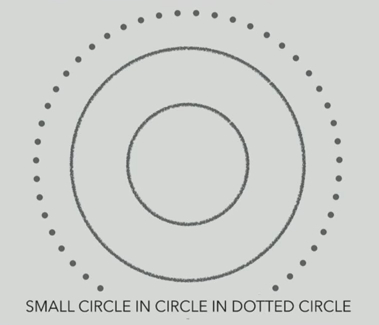
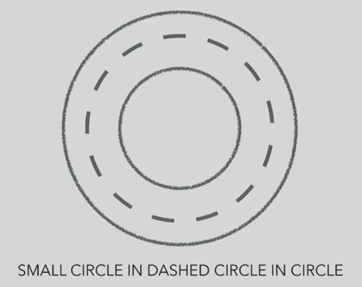

# React Component Patterns

YouTube video by Michael Chan: https://www.youtube.com/watch?v=YaZg8wg39QQ

## Circles!



Think of a component patterns as different types of circles & combinations of circles.

## Circle & Small Circle



Circle:

* render, state, lifecycle events
* smart/stateful component

Small Circle:

* render, props, context
* dumb/presentational/stateless component

## Small Circle in Circle ("Container Component")



Here, we're just combining the two back together... so why is this useful?

To _reuse_ the small circle. You can write your presentational/stateless components to be flexible, and in ways that can be used all over your app. Only need to write them once!

## Small Circle in Circle in Dotted Circle ("Higher Order Component")



```js
function DottedCircle(AnyCircle) {
  return class Circle extends React.Component {
    state = { smarts: 'smarts' }

    render() {
      return <AnyCircle {...this.state} />
    }
  }
}

function SmallCircle(props) {
  return <div>{props.smarts}</div>
}

var SmallCircleInCircle = DottedCircle(SmallCircle)
```

## Small Circle in Dashed Circle in Circle ("Component w/ Render Callbacks")



```js
class Circle extends React.Component {
  state = { smarts: 'smarts' }

  render() {
    return this.props.dashedCircle(this.state)
  }
}

function SmallCircle(props) {
  return <div>{props.smarts}</div>
}

const SmallCircleInCircle = (
  <Circle dashedCircle={state => <SmallCircle {...state} />} />
)
```
